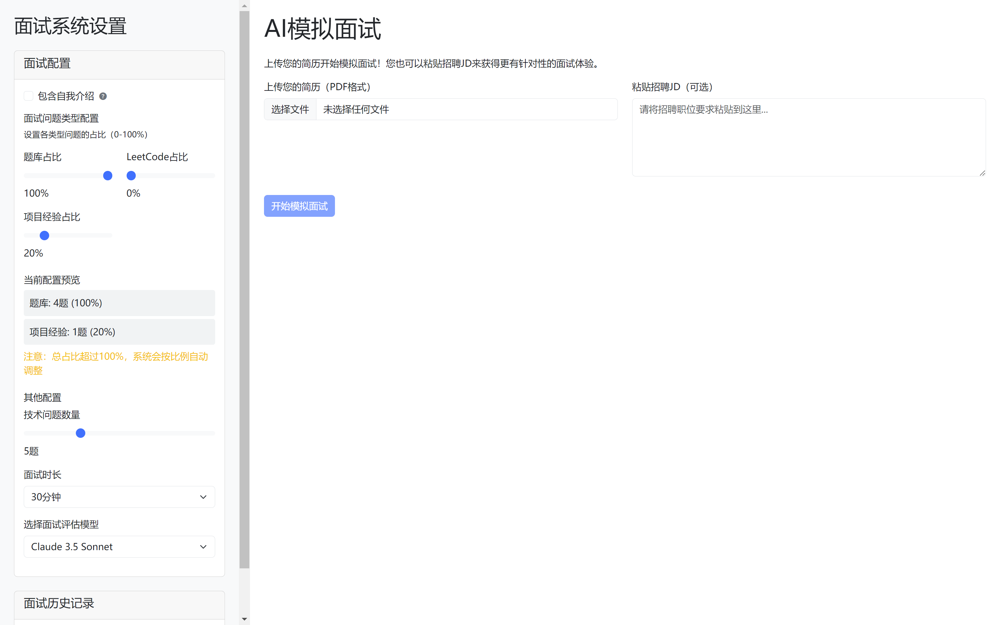

# AI-InterviewMaster

<div align="center">
  
  <p><strong>AI驱动的技术面试模拟平台 | AI-powered Technical Interview Simulator</strong></p>
</div>

[English](#english) | [中文](#chinese)



---

<a id="chinese"></a>
## 🇨🇳 中文介绍

AI-InterviewMaster 是一个基于AI技术的面试模拟平台，专为软件开发者、IT专业人士和计算机科学学生设计。它能够模拟真实的技术面试场景，提供即时反馈，帮助用户准备技术面试。


### ✨ 主要功能

- 🤖 **智能面试官模拟**：AI驱动的面试官，根据职位类型提出相关技术问题
- 🎯 **多种职位支持**：前端、后端、全栈、移动开发、DevOps等多种技术岗位
- 🔍 **即时反馈**：针对回答提供详细评估和改进建议
- 🗣️ **语音识别**：支持语音回答，更接近真实面试体验
- 📊 **表现分析**：提供面试表现的量化分析和可视化报告
- 📝 **面试历史**：记录并回顾过去的面试，跟踪进步

### 🛠️ 技术栈

**后端**：
- Python + FastAPI
- AI模型集成
- RESTful API设计

**前端**：
- HTML5 + CSS3 + JavaScript
- Bootstrap 5 
- Web Speech API (语音识别)

### 🚀 快速开始

#### 前提条件

- Python 3.8+
- pip (Python包管理器)

#### 安装步骤

1. 克隆仓库:
```bash
git clone https://github.com/YourUsername/AI-InterviewMaster.git
cd AI-InterviewMaster
```

2. 运行安装脚本:

对于Linux/macOS:
```bash
chmod +x run.sh
./run.sh
```

对于Windows:
```bash
run.bat
```

3. 访问应用:
   - 前端界面: [http://localhost:8000](http://localhost:8000)
   - 后端API文档: [http://localhost:5000/docs](http://localhost:5000/docs)

### 📁 项目结构

```
AI-InterviewMaster/
├── backend/               # 后端代码
│   ├── app.py             # 主应用入口
│   ├── models/            # 数据模型
│   ├── services/          # 业务逻辑服务
│   ├── database/          # 数据库相关
│   └── requirements.txt   # 依赖包列表
├── frontend/              # 前端代码
│   ├── index.html         # 主页面
│   ├── css/               # 样式文件
│   ├── js/                # JavaScript文件
│   └── assets/            # 静态资源
├── run.sh                 # Linux/macOS启动脚本
├── run.bat                # Windows启动脚本
└── README.md              # 项目说明
```

### 💡 使用提示

1. **选择职位类型**：根据您准备面试的职位类型选择相应的模拟面试
2. **时间设置**：可以设置面试时长，模拟真实面试环境
3. **语音回答**：点击麦克风图标使用语音回答问题
4. **查看反馈**：面试结束后查看详细的表现分析和改进建议
5. **练习弱项**：根据反馈针对性地加强弱项练习

---

<a id="english"></a>
## 🇬🇧 English

AI-InterviewMaster is an AI-powered interview simulation platform designed for software developers, IT professionals, and computer science students. It simulates real technical interview scenarios, provides instant feedback, and helps users prepare for technical interviews.

### ✨ Key Features

- 🤖 **Intelligent Interviewer Simulation**: AI-driven interviewer that asks relevant technical questions based on job type
- 🎯 **Multiple Job Categories**: Support for frontend, backend, full-stack, mobile development, DevOps, and more
- 🔍 **Instant Feedback**: Detailed assessment and improvement suggestions for your answers
- 🗣️ **Voice Recognition**: Support for voice responses, creating a more realistic interview experience
- 📊 **Performance Analytics**: Quantitative analysis and visualization of interview performance
- 📝 **Interview History**: Record and review past interviews to track progress

### 🛠️ Technology Stack

**Backend**:
- Python + FastAPI
- AI model integration
- RESTful API design

**Frontend**:
- HTML5 + CSS3 + JavaScript
- Bootstrap 5
- Web Speech API (voice recognition)

### 🚀 Quick Start

#### Prerequisites

- Python 3.8+
- pip (Python package manager)

#### Installation

1. Clone the repository:
```bash
git clone https://github.com/YourUsername/AI-InterviewMaster.git
cd AI-InterviewMaster
```

2. Run the setup script:

For Linux/macOS:
```bash
chmod +x run.sh
./run.sh
```

For Windows:
```bash
run.bat
```

3. Access the application:
   - Frontend interface: [http://localhost:8000](http://localhost:8000)
   - Backend API documentation: [http://localhost:5000/docs](http://localhost:5000/docs)

### 📁 Project Structure

```
AI-InterviewMaster/
├── backend/               # Backend code
│   ├── app.py             # Main application entry
│   ├── models/            # Data models
│   ├── services/          # Business logic services
│   ├── database/          # Database related
│   └── requirements.txt   # Dependency list
├── frontend/              # Frontend code
│   ├── index.html         # Main page
│   ├── css/               # Stylesheet files
│   ├── js/                # JavaScript files
│   └── assets/            # Static resources
├── run.sh                 # Linux/macOS startup script
├── run.bat                # Windows startup script
└── README.md              # Project documentation
```

### 💡 Usage Tips

1. **Select Job Type**: Choose the interview simulation based on the job position you're preparing for
2. **Time Settings**: Set the interview duration to simulate real interview environments
3. **Voice Responses**: Click the microphone icon to use voice for answering questions
4. **Review Feedback**: Check detailed performance analysis and improvement suggestions after the interview
5. **Practice Weak Areas**: Focus on improving weak areas based on feedback

---

## 📄 License

This project is licensed under the MIT License - see the [LICENSE](LICENSE) file for details.

## 🤝 Contributing

Contributions are welcome! Please feel free to submit a Pull Request.

1. Fork the repository
2. Create your feature branch (`git checkout -b feature/amazing-feature`)
3. Commit your changes (`git commit -m 'Add some amazing feature'`)
4. Push to the branch (`git push origin feature/amazing-feature`)
5. Open a Pull Request

## 📞 Contact

If you have any questions or suggestions, please open an issue or contact the repository owner.

---

<div align="center">
  <p>Built with ❤️ for the developer community</p>
</div>